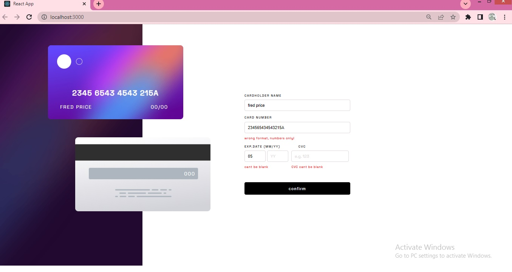
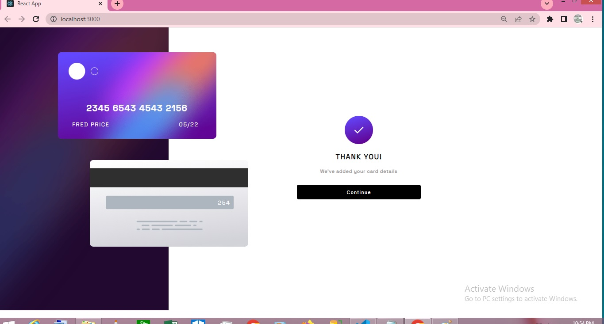
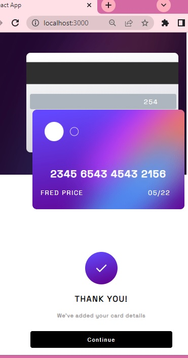
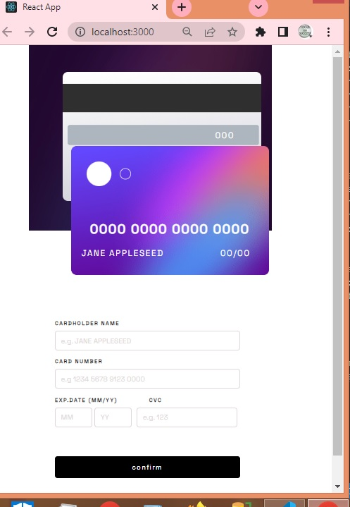

# Frontend Mentor - Interactive card details form solution

This is a solution to the [Interactive card details form challenge on Frontend Mentor](https://www.frontendmentor.io/challenges/interactive-card-details-form-XpS8cKZDWw). Frontend Mentor challenges help you improve your coding skills by building realistic projects.

## Table of contents

- [Overview](#overview)
  - [The challenge](#the-challenge)
  - [Screenshot](#screenshot)
  - [Links](#links)
- [My process](#my-process)
  - [Built with](#built-with)
  - [What I learned](#what-i-learned)
  - [Continued development](#continued-development)
  - [Useful resources](#useful-resources)
- [Author](#author)
- [Acknowledgments](#acknowledgments)

**Note: Delete this note and update the table of contents based on what sections you keep.**

## Overview

### The challenge

Users should be able to:

- Fill in the form and see the card details update in real-time
- Receive error messages when the form is submitted if:
  - Any input field is empty
  - The card number, expiry date, or CVC fields are in the wrong format
- View the optimal layout depending on their device's screen size
- See hover, active, and focus states for interactive elements on the page

### Screenshot






### Links

- Solution URL: [Add solution URL here](https://your-solution-url.com)
- Live Site URL: [Add live site URL here](https://your-live-site-url.com)

## My process

### Built with

- Semantic HTML5 markup
- Flexbox
- Mobile-first workflow
- [React](https://reactjs.org/) - JS library

### What I learned

-i got the opportunity to apply custom form validation in react

- got the opportunity to apply the knowledge of conditional rendering and prop drilling

To see how you can add code snippets, see below:

```JSX

{Object.keys(formErrors).length === 0 && isConfirm ? <Confirmation handleConfirm={ handleConfirm }/> :
<Form formData = {formData} handleChange= {handleChange} handleSubmit= {handleSubmit} formErrors={formErrors}/>}

<h2 className="card_number">{formData.card_number ? (formData.card_number).replace(/.{4}/g, '$& ') : `0000 0000 0000 0000` }</h2>
<p className="first_name" >{formData.card_name ? (formData.card_name).toUpperCase() : `JANE APPLESEED` }</p>
<p className="date" >{formData.exp_mnth && formData.exp_yr ? `${formData.exp_mnth}/${formData.exp_yr}` : `00/00`}</p>

```

```css
@media screen and (max-width: 1024px) {
  .main_section {
    height: 900px;
    width: 900px;
    display: flex;
    flex-direction: column;
    flex-wrap: wrap;
    align-items: center;
  }

  .left_section {
    background-image: url(./images/bg-resize-mobile.png);
    height: 500px;
    width: 460px;
    flex-direction: column;
    position: relative;
  }

  .right_section {
    height: 400px;
    width: 460px;
    flex-direction: column;
  }

  .front_page {
    width: 375px;
    border-radius: 10px;
    position: absolute;
    margin-top: 0;
    top: 190px;
    z-index: 2;
  }

  .back_page {
    width: 375px;
    background-position: center;
    border-radius: 10px;
    position: absolute;
    margin-top: 0;
    margin-left: 0;
    top: 50px;
    left: 65px;
    z-index: 1;
  }

  .first_name {
    display: inline;
    margin-left: 20px;
    margin-right: 40px;
  }

  .date {
    display: inline;
    float: right;
    margin-right: 35px;
  }

  form {
    margin-left: 20px;
    margin-left: 50px;
    margin-top: 20px;
  }
}
```

```js
const validate = (values) => {
  const errors = {};
  const regEx_number = /\D/;
  const regEx_alphabet = /[^a-zA-Z ]/;

  if (!values.card_number) {
    errors.card_number = "Card Number is Required";
  } else if (values.card_number.match(regEx_number)) {
    errors.card_number = "wrong format, numbers only!";
  } else if (values.card_number.length < 16) {
    errors.card_number = "must not be less than 16 digits";
  } else if (values.card_number.length > 16) {
    errors.card_number = "must not be more than 16 digits";
  }

  if (!values.card_name) {
    errors.card_name = "Card Name is Required";
  } else if (values.card_name.match(regEx_alphabet)) {
    errors.card_name = "wrong format, alphabets only";
  } else if (values.card_name.length < 5) {
    errors.card_name = "must not be less than five characters";
  }

  if (!values.exp_mnth) {
    errors.exp_mnth = "cant be blank";
  }
  if (!values.exp_yr) {
    errors.exp_mnth = "cant be blank";
  }
  if (!values.cvc) {
    errors.cvc = "CVC cant be blank";
  } else if (values.cvc.match(regEx_number)) {
    errors.cvc = "wrong format, numbers only!";
  } else if (values.cvc.length < 3) {
    errors.cvc = "must not be less than 3 digits";
  } else if (values.cvc.length > 3) {
    errors.cvc = "must not be more than 3 digits";
  }

  return errors;
};
```

### Continued development

- applying useReducer and React Router for more complex state management and handling multiple pages in react

### Useful resources

- [form validation using react by Dipesh Malvia](https://www.youtube.com/watch?v=EYpdEYK25Dc&t=1120s) - This video helped me understand how to build custom form validation in react with error messages .

- [Client-side form Validation by MDN](https://developer.mozilla.org/en-US/docs/Learn/Forms/Form_validation) - This article helped me finally understand Javascript client side form validation. I'd recommend it to anyone still learning this concept.

## Author

- Website - [Add your name here](https://www.your-site.com)
- Frontend Mentor - [@yourusername](https://www.frontendmentor.io/profile/yourusername)
- Twitter - [@yourusername](https://www.twitter.com/yourusername)

**Note: Delete this note and add/remove/edit lines above based on what links you'd like to share.**

## Acknowledgments

i would like to acknowledge Dipesh Malvia for heleping me understand custom form validation through his youtube videos.
i would like to acknowledge my wife Isoken for her constant encouragement.
